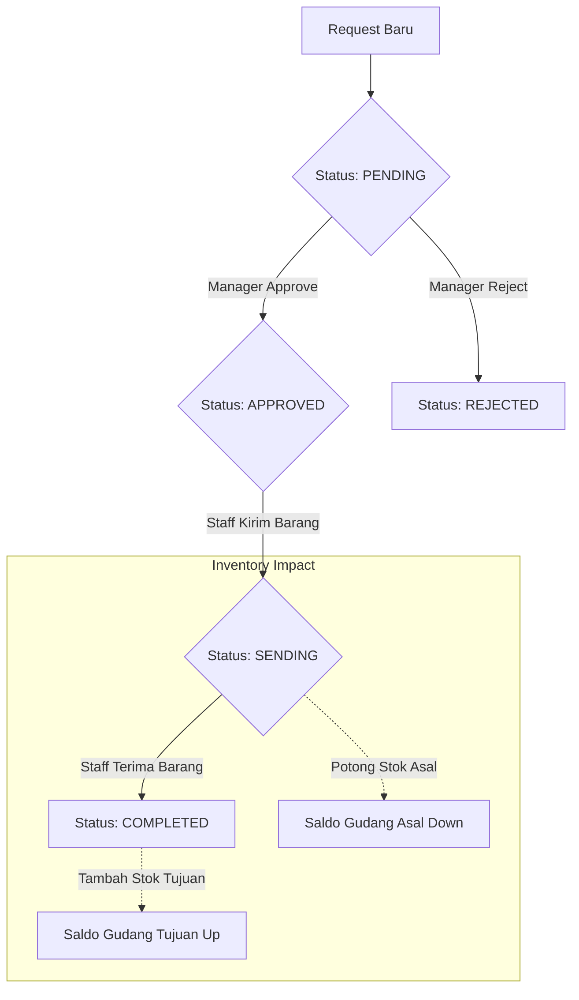

---

## Ringkasan Singkat (Executive Summary)
Modul Mutasi Barang menyediakan kerangka kerja terstruktur untuk mengelola perpindahan stok internal antar gudang. Dengan sistem pengajuan dan persetujuan (approval) yang terintegrasi, modul ini menjamin bahwa setiap pergerakan aset perusahaan terdokumentasi dengan baik, tervalidasi secara manajerial, dan tercermin secara akurat pada saldo inventaris real-time.

---

## 1. Analisis Bisnis & Deskripsi Fitur
Fitur ini dirancang untuk mengelola perpindahan stok barang antar gudang secara formal dan terkontrol. Alur ini memastikan bahwa setiap perpindahan barang memiliki alasan (seperti kebutuhan produksi/Work Order), melalui proses verifikasi oleh atasan, dan tercatat secara akurat dalam histori stok.

### Tujuan Utama:
- Mengurangi risiko kehilangan barang saat perpindahan antar lokasi.
- Memberikan visibilitas kepada PPIC dan Gudang mengenai status ketersediaan barang untuk Work Order tertentu.
- Menjamin akurasi saldo stok di setiap gudang (source vs destination).

---

## 2. Batasan Sistem (Scope Definition)

### A. Modul ini Mencakup (In Scope):
- **Pengajuan Permintaan**: Pembuatan dokumen Request Mutasi antar gudang internal.
- **Verifikasi Bertingkat**: Mekanisme Approval Workflow oleh pihak berwenang (Manager/Supervisor).
- **Eksekusi Logistik**: Proses realisasi pengiriman (Sending) dan konfirmasi penerimaan (Receiving).
- **Sinkronisasi Stok**: Update otomatis pada saldo stok di modul Inventory Terminal.
- **Pencatatan Audit**: Histori transaksi otomatis pada Kartu Stok (Stock Card).
- **Konektivitas Produksi**: Integrasi opsional dengan data Work Order untuk pelacakan bahan baku.

### B. Luar Cakupan (Out of Scope):
- Pembuatan Purchase Order otomatis ke supplier jika stok gudang asal kosong (masuk ke modul Purchasing).
- Inspeksi kualitas barang (Quality Control) secara mendalam saat mutasi (masuk ke modul QC).
- Perhitungan valuasi akuntansi atau biaya pengiriman (masuk ke modul Finance/Accounting).
- Pengiriman ke pihak eksternal/customer (masuk ke modul Sales/Delivery).

---

## 3. Penanganan Jika Data Work Order Belum Tersedia
Sistem didesain secara fleksibel untuk menangani kondisi di mana modul atau data **Work Order** belum ada atau tidak ingin digunakan:
- **Mutasi Umum (General)**: Form permintaan mutasi tetap dapat diproses tanpa mengisi field Work Order.
- **Optional Field**: Field `work_order_id` pada database dan antarmuka bersifat opsional (*nullable*).
- **Independensi Modul**: Alur mutasi gudang tidak memiliki dependensi keras terhadap modul produksi, sehingga operasional gudang tetap dapat berjalan mandiri.

---

## 4. Struktur Navigasi & Posisi Halaman
Akses terhadap fitur mutasi dikelompokkan dalam menu utama **Order** untuk memudahkan koordinasi dengan permintaan pembelian lainnya:

- **Main Menu**: Order
    - **Sub Menu**: Mutasi Gudang
        - **Halaman 1**: Request Mutasi (Digunakan untuk pengajuan baru dan tracking permintaan oleh staff).
        - **Halaman 2**: Approval Mutasi (Digunakan oleh manager untuk meninjau dan memberikan keputusan persetujuan).

---

## 5. Struktur Peran & Hak Akses (User Roles)
| Role | Tanggung Jawab dalam Fitur |
| :--- | :--- |
| **Operator Produksi / Staff Gudang** | Membuat **Request Mutasi** berdasarkan kebutuhan bahan baku atau pemindahan rutin. |
| **Manager Gudang / Supervisor** | Melakukan **Approval** atau **Rejection** terhadap permintaan yang diajukan. |
| **Admin Gudang (Logistik)** | Mengeksekusi pengiriman barang (**Mutasi Gudang**) dan memverifikasi penerimaan. |

---

## 6. Alur Kerja (Business Logic Flow)

### Tahap 1: Request Mutasi (Pengajuan)
- **Kondisi Awal**: Staff mengidentifikasi kekurangan stok di gudang tujuan atau kebutuhan bahan untuk Work Order.
- **Aksi User**: Memasukkan Gudang Asal, Gudang Tujuan, daftar item, jumlah, dan referensi Work Order (jika ada).
- **Hasil**: Dokumen mutasi dibuat dengan status `PENDING`. Belum ada pemotongan stok pada tahap ini.

### Tahap 2: Approval Mutasi (Verifikasi)
- **Kondisi Awal**: Terdapat dokumen mutasi dengan status `PENDING`.
- **Aksi User**: Manager memeriksa ketersediaan stok di gudang asal dan urgensi permintaan. Manager menekan tombol `APPROVE` atau `REJECT`.
- **Hasil**: 
    - Jika `APPROVE`: Status berubah menjadi `APPROVED`.
    - Jika `REJECT`: Status berubah menjadi `REJECTED`, alur berhenti.

### Tahap 3: Mutasi Gudang (Eksekusi & Realisasi)
- **Kondisi Awal**: Dokumen mutasi berstatus `APPROVED`.
- **Aksi User (Kirim)**: Admin Gudang asal memproses pengiriman. Status berubah menjadi `SENDING`.
- **Aksi User (Terima)**: Admin Gudang tujuan memverify fisik barang yang datang. Status berubah menjadi `COMPLETED`.

---

## 7. Dampak Terhadap Modul Lain (Impact Analysis)

### A. Modul Inventory (Saldo Stok)
Dampak pada saldo stok terjadi dalam dua fase untuk menjaga integritas data:
1.  **Fase Pengiriman (`SENDING`)**: 
    - Stok di **Gudang Asal** akan berkurang secara otomatis sesuai jumlah yang dikirim.
    - Status stok di database akan mencatat pengurangan ini untuk mencegah barang yang sama dikirim dua kali.
2.  **Fase Penerimaan (`COMPLETED`)**:
    - Stok di **Gudang Tujuan** akan bertambah secara otomatis.
    - Nilai stok akan ter-update secara real-time di halaman Inventory Terminal.

### B. Modul Kartu Stok (Stock Card)
Setiap transaksi mutasi yang selesai akan menghasilkan dua entri histori:
- **Entri Keluar (Out)**: Mencatat pengurangan stok di gudang asal dengan keterangan "Mutasi Keluar ke [Gudang Tujuan]".
- **Entri Masuk (In)**: Mencatat penambahan stok di gudang tujuan dengan keterangan "Mutasi Masuk dari [Gudang Asal]".

### C. Modul Work Order (Production)
Jika mutasi dikaitkan dengan Work Order:
- Dashboard Shop Floor akan menunjukkan status ketersediaan bahan yang lebih akurat.
- Tim produksi dapat mengetahui bahwa bahan yang mereka minta sedang dalam perjalanan atau sudah tersedia di gudang produksi.

---

## 8. Workflow Status Dokumen

---

## 9. Acceptance Criteria (Kriteria Penerimaan)
Sebuah transaksi mutasi dianggap berhasil dan valid jika memenuhi kriteria berikut:
1. **Validasi Input**: User tidak dapat mengirimkan permintaan jika stok di gudang asal (current stock) lebih kecil dari jumlah yang diminta.
2. **Otorisasi**: Tombol Approval hanya aktif bagi user dengan role Manager/Supervisor; Staff biasa hanya dapat melihat status.
3. **Integritas Stok (Source)**: Stok di gudang asal berkurang tepat saat status berubah menjadi `SENDING`.
4. **Integritas Stok (Destination)**: Stok di gudang tujuan bertambah tepat saat status berubah menjadi `COMPLETED` (setelah verifikasi penerimaan).
5. **Audit Trail**: Setiap mutasi menghasilkan entri otomatis pada Kartu Stok untuk kedua gudang yang terlibat.
6. **Unique Reference**: Sistem menghasilkan nomor referensi mutasi yang unik dan tidak dapat diubah (immutable) untuk keperluan audit.

---

## 10. Kesimpulan
Implementasi alur Mutasi Barang ini memberikan kontrol mekanis yang kuat terhadap pergerakan stok perusahaan, meminimalisir kesalahan manusia (*human error*), serta mencegah selisih stok antar departemen. Dengan memisahkan proses pengajuan, persetujuan, dan realisasi, sistem memastikan akuntabilitas di setiap tahapan, sehingga laporan inventaris akhir menjadi sumber data tunggal (*single source of truth*) yang dapat dipercaya untuk pengambilan keputusan operasional.
