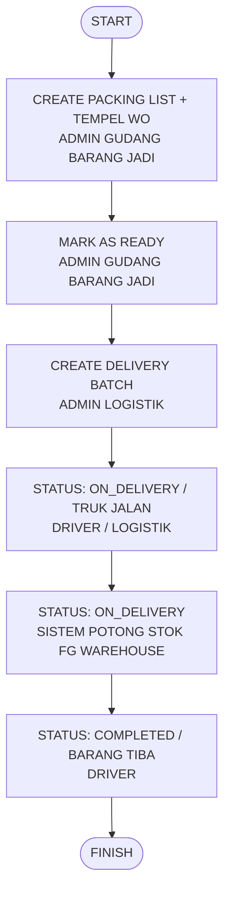

# SDD - ALUR PACKING LIST, DELIVERY BATCH & TRACKING (FLOW 3)

## 1. Flowchart Diagram
Berikut adalah diagram alur proses pengemasan barang jadi, konsolidasi armada logistik, hingga serah terima barang ke pelanggan:

---

## 2. Database System (Skema & Tabel)
Tabel-tabel database yang terlibat langsung dalam mengontrol alur kemasan, pengiriman, dan pelacakan di atas:

### A. Tabel `delivery_batches` (Header Konsolidasi Armada)
*   **`id`** (bigint, PK) - ID unik batch.
*   **`batch_no`** (string, Unique) - Nomor batch pengiriman otomatis (Format: `DEL-YYYYMMDD-[Hex]`).
*   **`destination`** (string) - Tujuan alamat pengiriman (gabungan alamat/nama customer).
*   **`driver_name`** (string, Nullable) - Nama supir pengantar.
*   **`vehicle_no`** (string, Nullable) - Plat nomor kendaraan/truk.
*   **`status`** (string) - Status batch (`PENDING`, `ON_DELIVERY`, `COMPLETED`).
*   **`departure_at`** (datetime, Nullable) - Tanggal/jam armada berangkat dari pabrik.
*   **`arrival_at`** (datetime, Nullable) - Tanggal/jam armada tiba di tempat pelanggan.
*   **`user_id`** (bigint, FK) - Staff Logistik pembuat batch.

### B. Tabel `packing_lists` (Header Pengemasan)
*   **`id`** (bigint, PK) - ID unik Packing List.
*   **`packing_no`** (string, Unique) - Nomor Packing List otomatis (Format: `PKG-YYYYMMDD-[Hex]`).
*   **`customer_id`** (bigint, FK, Nullable) - Tujuan pelanggan.
*   **`delivery_batch_id`** (bigint, FK, Nullable) - Relasi ke `delivery_batches.id` (batch terpilih).
*   **`status`** (string) - Status kemasan (`DRAFT`, `READY`, `SHIPPED`).
*   **`user_id`** (bigint, FK) - Operator pengemasan.

### C. Tabel `packing_list_details` (Detail Kemasan Barang Jadi)
*   **`id`** (bigint, PK) - ID detail.
*   **`packing_list_id`** (bigint, FK) - Relasi ke `packing_lists.id`.
*   **`item_id`** (bigint, FK) - Barang jadi yang dikemas.
*   **`quantity`** (decimal) - Jumlah barang yang dikemas.
*   **`package_type`** (string) - Jenis wadah kemasan (`Box`, `Pallet`, `Bag`).
*   **`package_number`** (string, Nullable) - Nomor urut paket wadah (misalnya `Box #01`).

### D. Tabel `inventory_stocks` (Saldo Stok Terkini)
*   **`item_id`** (bigint, FK) - ID barang jadi.
*   **`warehouse_id`** (bigint, FK) - ID Gudang Barang Jadi (Finished Goods Warehouse).
*   **`current_stock`** (decimal) - Stok fisik aktual (dikurangi secara otomatis saat status batch berubah menjadi `ON_DELIVERY`).

### E. Tabel `stock_transactions` (Kartu Stok / Audit Trail)
*   **`item_id`** (bigint, FK) - ID barang.
*   **`warehouse_id`** (bigint, FK) - ID Gudang Barang Jadi.
*   **`type`** (enum) - Jenis mutasi (`OUT` tercatat saat status batch di-update ke `ON_DELIVERY`).
*   **`quantity`** (decimal) - Kuantitas barang keluar.
*   **`reference_no`** (string) - Referensi nomor batch pengiriman (`batch_no`).
