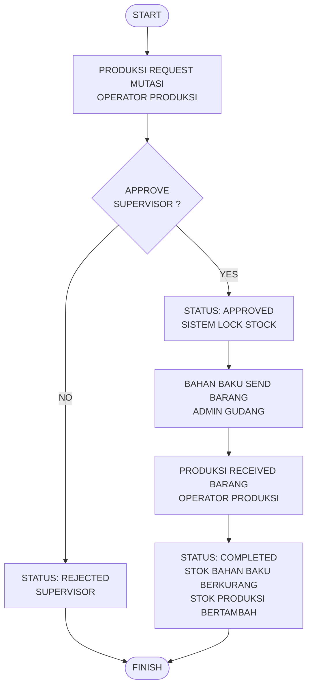

# SDD - ALUR MUTASI BAHAN BAKU KE PRODUKSI (FLOW 1)

## 1. Flowchart Diagram
Berikut adalah diagram alur proses Mutasi Bahan Baku ke Produksi yang menggambarkan perpindahan barang fisik beserta perubahan status stok sistemnya:

---

## 2. Database System (Skema & Tabel)
Tabel-tabel database yang terlibat langsung dalam mengontrol alur mutasi di atas:

### A. Tabel `stock_mutations` (Header Request)
*   **`id`** (bigint, PK) - ID unik mutasi.
*   **`reference_no`** (string, Unique) - Nomor referensi mutasi (Format: `MUT-YYYYMMDD-[Hex]`).
*   **`work_order_id`** (bigint, FK) - Relasi ke tabel `work_orders.id` (Work Order terkait).
*   **`from_warehouse_id`** (bigint, FK) - Gudang asal / Gudang Bahan Baku.
*   **`to_warehouse_id`** (bigint, FK) - Gudang tujuan / Gudang Produksi.
*   **`status`** (enum) - Status transaksi (`PENDING`, `APPROVED`, `SENDING`, `COMPLETED`, `REJECTED`).
*   **`user_id`** (bigint, FK) - Operator pembuat request.
*   **`approved_by`** (bigint, FK, Nullable) - Supervisor yang menyetujui.
*   **`sent_by`** (bigint, FK, Nullable) - Admin gudang pengirim.
*   **`received_by`** (bigint, FK, Nullable) - Operator penerima.

### B. Tabel `stock_mutation_details` (Detail Barang)
*   **`id`** (bigint, PK) - ID detail.
*   **`stock_mutation_id`** (bigint, FK) - Relasi ke `stock_mutations.id`.
*   **`item_id`** (bigint, FK) - Barang / bahan baku yang dimutasi.
*   **`quantity`** (decimal) - Jumlah barang yang diminta.

### C. Tabel `inventory_stocks` (Saldo Stok Terkini)
*   **`item_id`** (bigint, FK) - ID barang.
*   **`warehouse_id`** (bigint, FK) - ID gudang.
*   **`current_stock`** (decimal) - Stok fisik aktual (berkurang di bahan baku saat SENDING, bertambah di produksi saat COMPLETED).
*   **`lock_stock`** (decimal) - Stok yang di-booking (bertambah saat APPROVED, berkurang saat COMPLETED).

### D. Tabel `stock_transactions` (Kartu Stok / Audit Trail)
*   **`item_id`** (bigint, FK) - ID barang.
*   **`warehouse_id`** (bigint, FK) - ID gudang.
*   **`type`** (enum) - Jenis mutasi (`IN`, `OUT`, `LOCK_IN`, `LOCK_OUT`).
*   **`quantity`** (decimal) - Kuantitas mutasi.
*   **`reference_no`** (string) - Referensi nomor mutasi.
