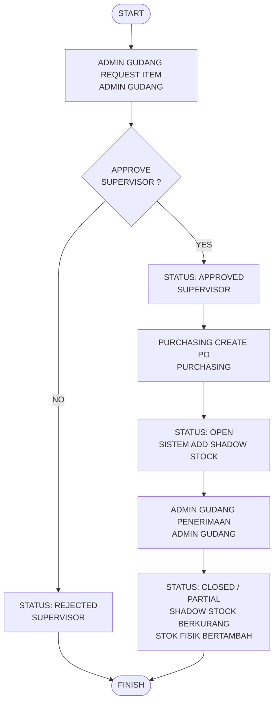

# SDD - ALUR PROCUREMENT & PENERIMAAN BARANG (FLOW 2)

## 1. Flowchart Diagram
Berikut adalah diagram alur proses pengadaan barang (procurement) dari pengajuan internal gudang hingga realisasi fisik barang masuk:

---

## 2. Database System (Skema & Tabel)
Tabel-tabel database yang terlibat langsung dalam mengontrol alur pengadaan di atas:

### A. Tabel `item_requests` (Permintaan Barang)
*   **`id`** (bigint, PK) - ID unik request.
*   **`reference_no`** (string, Unique) - Nomor referensi request (Format: `REQ-YYYYMMDD-[Hex]`).
*   **`user_id`** (bigint, FK) - Admin gudang pembuat request.
*   **`warehouse_id`** (bigint, FK) - Gudang target penampung barang.
*   **`status`** (enum) - Status request (`PENDING`, `APPROVED`, `REJECTED`, `COMPLETED`, `CANCELLED`).
*   **`approved_by`** (bigint, FK, Nullable) - Supervisor penyetuju.

### B. Tabel `item_request_details` (Detail Barang Permintaan)
*   **`id`** (bigint, PK) - ID detail.
*   **`item_request_id`** (bigint, FK) - Relasi ke `item_requests.id`.
*   **`item_id`** (bigint, FK) - Barang yang diminta.
*   **`quantity`** (decimal) - Kuantitas barang.

### C. Tabel `purchase_orders` (Purchase Order Header)
*   **`id`** (bigint, PK) - ID unik PO.
*   **`po_no`** (string, Unique) - Nomor PO resmi (Format: `PO-YYYYMMDD-[Hex]`).
*   **`item_request_id`** (bigint, FK, Nullable) - Referensi draf permintaan asal.
*   **`supplier_id`** (bigint, FK) - Supplier terpilih.
*   **`user_id`** (bigint, FK) - Staff Purchasing pembuat PO.
*   **`status`** (enum) - Status PO (`DRAFT`, `OPEN`, `PARTIAL`, `CLOSED`, `CANCELLED`).
*   **`total_amount`** (decimal) - Total nilai nominal pembelian PO.

### D. Tabel `purchase_order_details` (Detail Barang PO)
*   **`id`** (bigint, PK) - ID detail PO.
*   **`purchase_order_id`** (bigint, FK) - Relasi ke `purchase_orders.id`.
*   **`item_id`** (bigint, FK) - Barang yang dipesan.
*   **`quantity`** (decimal) - Jumlah yang dipesan ke supplier.
*   **`received_quantity`** (decimal) - Jumlah fisik barang yang sudah diterima.
*   **`price`** (decimal) - Harga satuan barang.

### E. Tabel `inventory_stocks` (Saldo Stok Terkini)
*   **`item_id`** (bigint, FK) - ID barang.
*   **`warehouse_id`** (bigint, FK) - ID gudang.
*   **`current_stock`** (decimal) - Stok fisik aktual (bertambah saat barang diterima fisik).
*   **`shadow_stock`** (decimal) - Stok ekspektasi kedatangan (bertambah saat PO dibuat, berkurang senilai jumlah yang diterima fisik).

### F. Tabel `stock_transactions` (Kartu Stok / Audit Trail)
*   **`item_id`** (bigint, FK) - ID barang.
*   **`warehouse_id`** (bigint, FK) - ID gudang.
*   **`type`** (enum) - Jenis transaksi (`IN`, `SHADOW_IN`, `SHADOW_OUT`).
*   **`quantity`** (decimal) - Kuantitas transaksi.
*   **`reference_no`** (string) - Referensi nomor PO.
