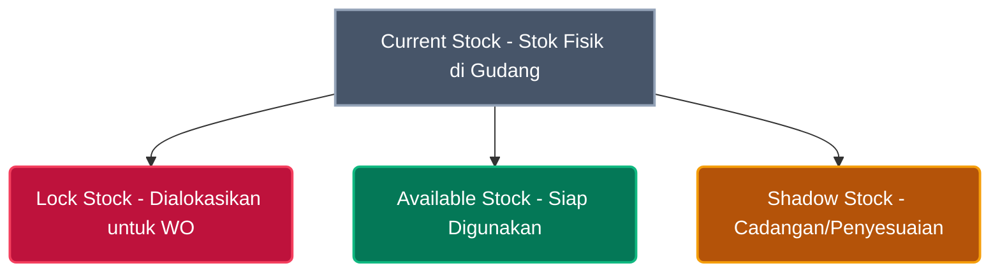
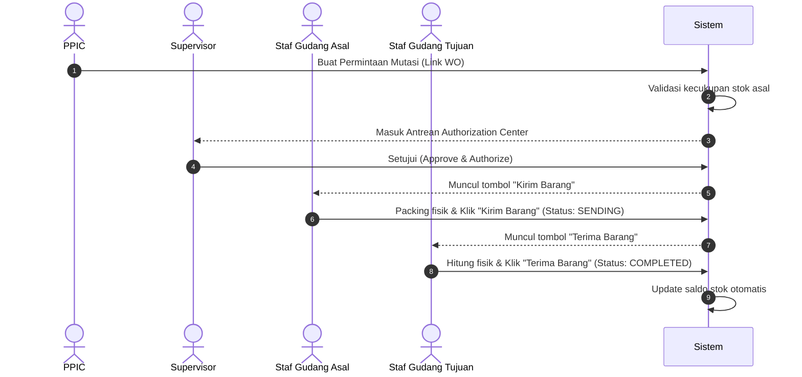
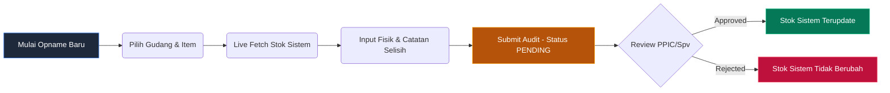

# Panduan Training Sistem Inventory - Aori Manufaktur
*Dokumen Pelatihan Operasional untuk Tim PPIC dan Staff Gudang*

> [!NOTE]  
> Dokumen ini dirancang sebagai panduan resmi pelatihan operasional modul **Inventory & Warehouse** pada sistem ERP Aori Manufaktur. Panduan ini mencakup integrasi kerja antara tim PPIC (perencanaan & kontrol) dan tim Gudang (pelaksana fisik).

---

## 1. Matrix Tanggung Jawab (PPIC vs Gudang)
Untuk menjaga integritas data dan kelancaran rantai pasok produksi, tugas-tugas di dalam sistem ERP dibagi secara tegas berdasarkan peran masing-masing:

| Fitur / Menu | Peran PPIC (Planning & Control) | Peran Gudang (Execution & Audit) |
| :--- | :--- | :--- |
| **Inventory Management Terminal** | Memantau pergerakan stok manual secara global dan menganalisis tren stock-in/out. | Menginput transaksi penyesuaian manual (Stock In/Out) fisik seperti sampel, scrap, atau retur. |
| **Request Mutasi Barang** | Membuat permintaan mutasi bahan baku berdasarkan kebutuhan Work Order (WO) aktif. | - |
| **Approval Mutasi** | Otorisasi/Persetujuan perpindahan barang antar gudang di *Authorization Center*. | - |
| **Eksekusi Pengiriman (Kirim)** | - | Staf Gudang Asal melakukan verifikasi fisik dan menekan tombol **Kirim Barang** di sistem. |
| **Eksekusi Penerimaan (Terima)** | - | Staf Gudang Tujuan menghitung fisik kedatangan dan menekan tombol **Terima Barang** di sistem. |
| **Stock Opname (Audit Fisik)** | Menganalisis hasil selisih opname dan memberikan otorisasi penyesuaian stok (*Approval*). | Melakukan perhitungan fisik di lapangan dan menginput hasil perhitungan ke dalam sistem (*Audit Terminal*). |
| **Kartu Stok (Stock Card)** | Melakukan pelacakan mendalam (audit trail) untuk menelusuri ketidaksesuaian nilai saldo stok. | Memastikan kartu stok digital selalu sinkron dengan kartu stok fisik di rak penyimpanan. |

---

## 2. Pemahaman Konsep Saldo Stok (4 Levels of Stock)
Di Aori Manufaktur, satu SKU barang memiliki **4 indikator nilai stok** yang berbeda. Pemahaman konsep ini sangat penting terutama bagi tim PPIC saat merencanakan bahan baku produksi:

1. **Current Stock (Stok Aktual)**
   * **Definisi**: Total kuantitas barang yang secara fisik saat ini berada di dalam gudang.
   * **Penggunaan**: Acuan bagi tim Gudang untuk penataan ruang penyimpanan.
2. **Lock Stock (Stok Terkunci)**
   * **Definisi**: Stok yang sudah dialokasikan/dipesan untuk Work Order (WO) yang sedang berjalan atau mutasi yang sudah disetujui tetapi barangnya belum dikirim secara fisik.
   * **Penggunaan**: Mencegah barang yang sama digunakan double untuk produksi lain.
3. **Available Stock (Stok Tersedia)**
   * **Definisi**: Stok riil yang bebas digunakan untuk proses transaksi atau produksi baru.
   * **Rumus**: `Available Stock = Current Stock - Lock Stock`
   * **Penggunaan**: Indikator utama PPIC saat membuat Work Order baru. Jika Available Stock kurang, PPIC wajib melakukan pengadaan.
4. **Shadow Stock (Stok Bayangan)**
   * **Definisi**: Indikator stok cadangan/virtual yang disiapkan untuk penyesuaian sementara atau proyeksi kebutuhan masa depan tanpa mengganggu kalkulasi stok fisik berjalan.

---

## 3. SOP Operasional Modul Inventory

### ALUR 1: Mutasi Stok Antar Gudang (Bahan Baku ke Produksi)
Prosedur mutasi barang antar gudang dirancang untuk mencegah kehilangan material dan memastikan pencatatan perpindahan barang selalu akurat secara real-time.

#### Langkah Detail Sistem:
1. **Pembuatan Permintaan (PPIC)**:
   * Buka menu **Transactions > Mutations > Request**.
   * Klik **Buat Permintaan Baru**.
   * Pilih **Work Order terkait (opsional)** jika mutasi ini ditujukan khusus untuk menunjang pengerjaan perintah kerja tertentu.
   * Pilih **Gudang Asal** (gudang pengirim) dan **Gudang Tujuan** (gudang penerima).
   * Tambahkan Item yang diminta, tentukan **Quantity**, dan klik tambah jika ada lebih dari 1 SKU.
   * *Catatan Sistem*: Pada bagian bawah item, sistem akan menampilkan secara live **Stok Asal** dan **Stok Tujuan**.
   * Klik **Kirim Permintaan**.

> [!WARNING]  
> **Validasi Stok Otomatis**: Jika jumlah barang yang diminta melebihi kapasitas *Available Stock* di gudang asal, sistem secara otomatis akan memblokir pengiriman dan menampilkan notifikasi modal bertuliskan **"Stok Asal Tidak Mencukupi"**. PPIC akan langsung diarahkan ke menu *Request Item (Purchasing)* untuk melakukan pengadaan barang baru.

2. **Otorisasi & Persetujuan (PPIC Supervisor/Manager)**:
   * Buka menu **Transactions > Mutations > Approval**.
   * Tinjau kartu antrean mutasi yang masuk. Periksa nama item, jumlah, gudang asal/tujuan, serta catatan PPIC.
   * Klik **Approve & Authorize** jika data sudah benar.
   * Klik **Reject Request** jika ada kesalahan input (sistem akan mewajibkan pengisian **Alasan Penolakan** di dalam modal SweetAlert2 sebelum memproses penolakan).

3. **Eksekusi Pengiriman (Gudang Asal)**:
   * Setelah disetujui, buka menu **Transactions > Mutations (Monitor & Eksekusi Mutasi)**.
   * Cari nomor referensi mutasi terkait. Sistem akan mengaktifkan tombol biru **"Kirim Barang"**.
   * Lakukan persiapan fisik barang, pastikan jumlah sesuai dokumen ERP.
   * Klik **Kirim Barang** dan konfirmasi pada modal pop-up. Status mutasi akan berubah menjadi **SENDING** (Stok di gudang asal akan langsung berkurang dan masuk ke status *Lock Stock* transit).

4. **Eksekusi Penerimaan (Gudang Tujuan)**:
   * Setelah barang fisik tiba di gudang tujuan, hitung kembali kuantitas fisik.
   * Buka menu **Transactions > Mutations**.
   * Cari nomor referensi mutasi terkait. Sistem akan memunculkan tombol hijau **"Terima Barang"**.
   * Klik **Terima Barang** dan konfirmasi pada modal pop-up. Status mutasi akan berubah menjadi **COMPLETED** (Stok gudang penerima bertambah secara real-time dan log aktivitas tercatat lengkap).

---

### ALUR 2: Transaksi Stok Manual (Stock In / Stock Out)
Menu ini digunakan oleh tim Gudang untuk mencatat mutasi stok yang tidak terikat dengan transaksi komersial (seperti Purchase Order atau Work Order).

#### Kasus Penggunaan:
* **Stock In Manual**: Memasukkan barang sisa sampel pameran, barang uji coba mesin, atau barang temuan yang tidak tercatat sebelumnya.
* **Stock Out Manual**: Mengeluarkan barang karena rusak (broken), busuk/kedaluwarsa, atau sampel gratis untuk pelanggan.

#### Langkah Detail Sistem:
1. Buka menu **Transactions > Inventory**.
2. Klik tombol **Buat Transaksi Baru** untuk memunculkan modal terminal operasi inventory yang modern.
3. Tentukan **Type** transaksi:
   * **Stock In** (warna hijau): Menambah stok fisik gudang.
   * **Stock Out** (warna merah): Mengurangi stok fisik gudang.
4. Pilih **Warehouse Location** (Lokasi Gudang fisik penyimpanan).
5. Isi **Ref. Number** (contoh: *RETUR-MANUAL-01*, *BROKEN-SAMPLE-02*, dll).
6. Pada tabel spesifikasi item, pilih **SKU Produk**. Sistem akan memunculkan informasi stok berjalan saat ini di gudang tersebut secara live (*Stok: X*).
7. Masukkan kuantitas (**Quantity**) dan **Catatan Tambahan** (opsional, contoh: "Rusak karena air hujan").
8. Klik **Submit Transaction**. Data stok akan langsung terupdate di gudang terkait dan riwayat tercatat di Kartu Stok.

---

### ALUR 3: Stock Opname (Audit Fisik Stok)
Prosedur Stock Opname dirancang untuk memastikan keselarasan penuh antara sistem digital Aori Manufaktur dengan kondisi fisik nyata di lapangan tanpa mengganggu kelancaran transaksi harian.

#### Langkah Detail Sistem:
1. **Pencatatan Hasil Perhitungan (Staf Gudang)**:
   * Buka menu **Transactions > Stock Opname**.
   * Klik tombol **Mulai Opname Baru**.
   * Pilih **Warehouse Location** yang akan diaudit (Sekali gudang dipilih, kolom ini akan terkunci untuk memastikan konsistensi lokasi semua barang dalam daftar audit).
   * Pilih **Product/SKU** yang akan dihitung. Sistem secara otomatis menampilkan nilai stok digital saat ini di layar (*Current System Stock*).
   * Klik **Add to List** untuk memasukkan barang tersebut ke dalam tabel daftar audit.
   * Pada kolom aksi di tabel, klik tombol edit (ikon pensil berwarna indigo) untuk membuka modal detail audit barang.
   * Masukkan jumlah fisik riil hasil perhitungan di kolom **Physical Stock Count**.
   * Sistem secara otomatis menghitung selisih (*Difference*). 
     * Jika jumlah fisik cocok, sistem menampilkan badge **MATCH** berwarna hijau.
     * Jika fisik lebih banyak dari sistem, nilai selisih ditandai positif (`+X` warna indigo).
     * Jika fisik kurang dari sistem, nilai selisih ditandai negatif (`-X` warna merah).
   * **Wajib**: Isi kolom **Audit Notes / Reason** (contoh: "Selisih 2 roll karena robek di sudut rak").
   * Klik **Apply Audit Details** lalu klik **Submit Audit Data** untuk mengirim pengajuan penyesuaian (Status: **PENDING**).

2. **Otorisasi Penyesuaian (Supervisor/PPIC)**:
   * Buka menu **Transactions > Opname > Approval**.
   * Sistem akan menampilkan tabel antrean penyesuaian stok yang menunggu otorisasi.
   * Tinjau detail perbedaan stok yang diajukan beserta alasan selisih yang ditulis oleh staf gudang.
   * Klik **Approve** jika setuju (Sistem secara otomatis membuat transaksi penyesuaian di latar belakang, memperbarui *Current Stock*, dan mencatat jurnal di kartu stok).
   * Klik tombol merah **Reject** jika menolak pengajuan (Supervisor wajib memberikan **Alasan Penolakan** minimal 5 karakter, status berubah menjadi *REJECTED* dan nilai stok sistem tidak berubah).

---

### ALUR 4: Kartu Stok (Stock Card Tracking)
Kartu stok adalah alat audit utama yang digunakan PPIC maupun Gudang untuk melacak rekam jejak keluar masuknya barang sejak pertama kali diinput.

#### Cara Membaca & Menganalisis Kartu Stok:
1. Buka menu **Transactions > Stock Card**.
2. Anda akan disuguhkan informasi statistik global berupa:
   * **Total SKUs**: Total jenis produk terdaftar.
   * **Active Items**: Jenis produk yang aktif digunakan.
   * **Low Stock**: Jumlah SKU dengan stok menipis (di bawah 10 unit).
3. Cari SKU atau Nama Produk pada kolom pencarian, lalu tekan **Cari Produk**.
4. Klik tombol **Detail History** pada produk yang ingin dianalisis.
5. Halaman detail akan memaparkan ringkasan stok per-gudang dan status stok berjalan (Current, Lock, Shadow, Available).
6. Perhatikan tabel Riwayat Transaksi:
   * Setiap baris transaksi memiliki kolom **Tanggal & Waktu**, **Gudang**, **Tipe Transaksi** (IN/OUT/LOCK_IN/LOCK_OUT), **Kuantitas** (+ atau -), **Nomor Referensi** (PO/WO/Opname), serta **Running Balance (Saldo Current)**.
   * *Running Balance* dihitung secara kronologis terbalik (dari transaksi terlama ke terbaru) untuk melihat mutasi saldo secara tepat pada titik waktu tertentu.

---

## 4. Tips & Troubleshooting untuk User

### Permasalahan Umum & Solusinya:

* **Kendala 1: Tombol "Kirim Barang" atau "Terima Barang" tidak muncul pada menu Monitoring Mutasi.**
  * *Penyebab*: Otorisasi pengiriman dan penerimaan dibatasi berdasarkan hak akses gudang masing-masing user. Anda hanya bisa mengirim barang dari gudang tempat Anda ditugaskan, dan hanya bisa menerima barang di gudang tujuan tempat Anda ditugaskan.
  * *Solusi*: Hubungi Administrator untuk memastikan profil user Anda sudah dikaitkan dengan gudang asal/tujuan tersebut.

* **Kendala 2: Ingin membatalkan data audit Stock Opname yang salah input tetapi sudah telanjur di-Submit.**
  * *Penyebab*: Data yang sudah disubmit masuk ke fase *Pending Approval* dan tidak dapat diedit langsung oleh staf gudang.
  * *Solusi*: Minta Supervisor/PPIC untuk melakukan **Reject** pada antrean persetujuan opname tersebut dengan menuliskan alasan "Salah input data". Setelah direject, staf gudang dapat mengulangi proses pembuatan opname baru dengan data yang benar.

* **Kendala 3: Terdapat selisih stok fisik yang besar pada saat opname tetapi tidak diketahui penyebabnya.**
  * *Solusi*: Buka menu **Stock Card**, pilih item tersebut, lalu klik **Detail History**. Urutkan transaksi dan lakukan pencocokan silang (cross-match) nomor referensi transaksi dengan nota fisik (Surat Jalan/Bukti Kirim) secara kronologis untuk mendeteksi transaksi mana yang lupa diinput atau terinput ganda.

---

> [!IMPORTANT]  
> Seluruh proses transaksi dalam ERP Aori Manufaktur dirancang dengan sistem keamanan data berlapis. Pastikan Anda tidak membagikan kredensial login Anda kepada staf lain guna menjaga validitas penanggung jawab (Author/Auditor) di setiap aktivitas sistem.
